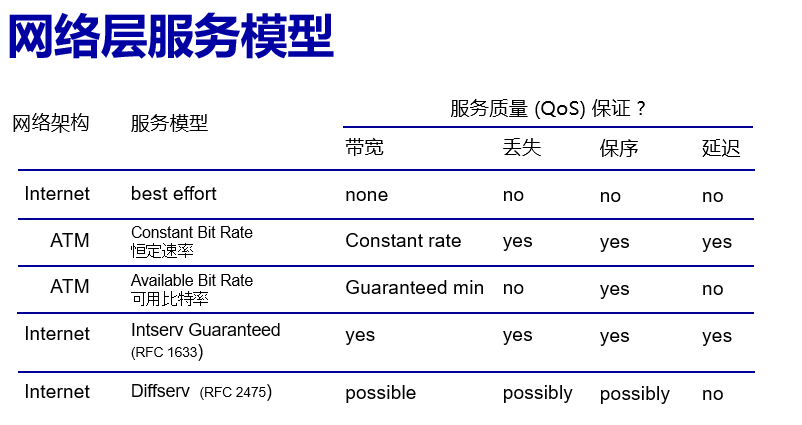

# 数据平面
网络层的两个功能：转发和路由

转发 ：在数据包到达路由器后，先从输入的链路，被路由器的输入接口接收，经过路由器的调转，前往指定的输出端口，发送到特定的输出链路，传递给下一个路由器或主机

路由：确定数据包从出发地点到目标主机采用的路由（路径）

网络层这两个分功能组合在一起，实现了互联网中主机和主机（说严谨些是端口之间，对于主机就是网卡）之间信息的传递

# 网络服务模型

提供怎样的服务？

部分网络架构服务如下

## 尽力而为best effort

网络层运输。尽力把数据送给对方，但不保证能成功传输，不保证传输时间和顺序，流量带宽不可控

其机制简单，易于拓展，所以早期被广泛应用

# 路由器的内部结构

整个路由器分成输入端口（左侧router input ports），交换结构(中间),输出端口(右侧的router output ports)

## 端口

路由器有多个输入端口和输出端口

输入端口从物理层，链路层收到各种数据包，放到端口的缓冲区中，其中的信息通过数据报的头部字段，寻找发往的输出端口，进行转发到特定的输出链路

当转发速度大于进入交换结构的速度，就会造成排队

### 输入端口的函数

输入端口的结构是这样的：

从左到右的中文翻译依次是：线路端接，数据链路处理，和查找、转发、排队。

线路端接通过和链路层，物理层连接，让数据包进入这个端口（按字接收），数据链路处理将收集到的数据包进行协议拆封，转换成网络层的数据报，方便后续解析，最后查找，转发排队的过程就是根据数据报报头的字段值，通过端口内存的转发表查找输出端口，并送到对应的端口，如果传入速度大于传出速度，那么数据包就会在这个地方发生排队。

## 基于目的地的转发

目的地，就是IP嘛，实际上ip存储的格式是二进制数

链路处理后就会从数据报中提取出这个32位的ip，2的32次方相当大，大约是40亿左右，一个转发表如果记住每个IP的值，对应着哪个输出端口，在ip到来时依次遍历搜索，在时间复杂度和空间复杂度上都是压力巨大的。所以我们可以只看这ip的前几位，通过前几位的值将数据报匹配到特定的输出窗口。

那么我们可以通过特定位数的内容将一部分IP分类，每个类别的ip被发到不同的输出端口

我们称这样标记的的表格为转发表

### 转发表的匹配规则——最长前缀匹配

我们不再看表的最后几位，而是前几位，对应的转发表就像这样

### 最长前缀匹配规则

表格给出了确定的位数，星号对应的位置具体内容不限。如果对应的ip复合表中的格式要求则被分配到对应的端口，如果符合的的格式有多个，则选择固定位数最长的那个

这个规则，我们通常在硬件上使用**三态内容可寻址存储器（TCAM）实现

# 交换结构

通过交换结构，我们将数据包从输入端口传送到输出端口

### 交换速率

通常以输入线路或输出线路速率的倍数来衡量，理想情况下，交换速率除以单个线路的交换速度得到的商应该就是端口的数量

交换结构主要是三种类型：内存，总线，互联网络

## 通过内存交换

### 第一代路由器

数据包从端口复制到内存，cpu提取地址，查找转发表后，再复制到对应的输出端口

一次只能处理一个端口，而且速度收到内存带宽的限制

## 通过总线交换

通过共享总线，将数据报从输入端口转移到输出端口

总线竞争：交换速度和总线带宽有关

## 通过互联网络（crossbar等）交换

这个”互联网络“不是Internet，是一个专有名词

这是一个复杂的网络，中间有多个节点（交换机）实现互联

我们会在入口处将数据报分成定长的信元，通过这个网络将每个信元发到出口再组装

我们还可以使用多个交换平面

这样就可以并行发送很多个数据

# 排队

## **输入端口排队**

1，如果中间交换结构处理速率小于输入端口的速率，数据报就会在缓存里排队

2，队首阻塞：队列最前端的数据报可能阻止队列后面的数据报转发（就是得排队，前面的发了，后面的才能往前走）

## 输出端口排队

若数据报到达输出端口的速率超过链路传输的速率时，就会产生排队，我们需要进行缓冲，丢弃策略，或是调整策略（从排队的数据报和中选择要传输的数据报）

### 需要多少的缓冲区？

RFC 3439 经验原则：缓冲区容量应等于"典型"往返时延（RTT，如250毫秒）乘以链路容量C
C = 10 Gbps 链路：需 2.5 Gbit 缓冲区
•最新建议：当存在N条流量时，缓冲区容量应等于 

注意：缓冲区过大可能会导致延迟增加，因为容纳的排队长度更长了，导致后来的可能需要等前面的长队

### 缓冲区管理

缓冲区管理策略：

- 丢弃策略：缓冲区满时决定添加或丢弃哪些数据报
    
    队尾丢弃：丢弃新到达的数据包
    
    优先级策略：基于优先级进行丢弃/移除
    
- 标记策略：确定哪些数据报需要被标记以指示拥塞

#### 标记策略
- **ECN (Explicit Congestion Notification，显式拥塞通知)**
    
    - **机制：** 当路由器发现缓冲区快满了（拥塞），它不会立刻丢包，而是在数据包的IP头里把“ECN位”设为1。
    - **过程：**
        1. 路由器把这个被标记的包转发给接收方。
        2. 接收方看到标记，知道网络堵了。
        3. 接收方在回给发送方的确认包（ACK）里告诉发送方：“网络堵了，请减速。”
        4. 发送方收到后，主动降低发送速度。
    - **优点：** 避免了丢包重传带来的额外开销，网络更平稳。

- **RED (Random Early Detection，随机早期检测)**
    
    - **机制：** 这是一个预防性措施。路由器不会等缓冲区100%满了才动手，而是设定一个阈值（比如80%）。
    - **过程：** 当队列长度超过这个阈值时，路由器就开始**随机**丢弃（或标记）一小部分数据包。
    - **目的：** 通过随机让少数几个连接丢包，迫使这几个连接减速。这样就避免了所有连接同时减速（避免了队尾丢弃的“全局同步”问题），从而把拥塞扼杀在萌芽状态。

## 数据报调度

### 先到先服务（FCFS）

顾名思义，单纯按照谁先到先传谁，后到的在后面排队

### 优先级调度

我们将到达的流量进行分类和排队，为这些数据报标记优先级。如果没有意外，就按当前序列发送数据报，如果新到了优先级更高的数据报，就先发那个优先级更高的

### 循环/轮循

我们也称这种思路为：加权公平排队

将到达的流量分类称好几组，具体的分类规则可以根据报头内容来定，接着传输系统循环服务这几个分组，这个分组传一个数据包，接着到下一个分组去传……来回往复

### 加权公平排队WFQ

在循环的基础上改变

每个分组得到一个权重，权重大的分组，分配给自己每次使用的带宽每次循环停留在这个分组传输数据包的时间更长，传的更多。自己的服务量就是自己的权重在所有权重总和中的占比

对于权重较低的分组，也会有一个最低带宽保证

[后两种方式的实现逻辑](note/计网/计网/第四五章——网络层/数据平面/实现方法.md)

# Internet Ipv4

路径选择算法生成转发表保存在路由器的内存中

IP协议用于寻址，找到路径，如何处理数据包

ICMP协议：返回信息，对ping的回应

## IP协议数据报格式

这是数据报头的内容，同样是一行32bit

- ver：IP协议的版本号
- head.len：头部总长度
- type of service:服务类别（一般就是尽力而为）
- length:数据报总长度
- time to live:数据报在路由器传输的时候，能传输多少跳（就是最多被转发几次），每经过一个路由器，这里保存的跳数值就会-1，如果路由器接手这个数据包时这里的值已经是0，那这个数据报就不被传输了
- upper layer：上层协议的标识（TCP还是UDP）
- 第二行的内容：涉及数据报的分片和重组
- header checksum：**头部信息**的检查和，如果头部信息都破损，那肯定不能用了
- source IP address：源IP地址
- destion IP address：终点IP地址
- options：可选项，一般是时戳，指定路由器经过的列表

## IP的分片和重组

前面提到。利用链路传输的话，需要将数据报分片

网络链路具备**MTU**（最大传输单元）：链路一次能传输的最大尺寸

所以需要将大型的数据报分片在链路中传输，在终点进行重组

具体分片过程：

1：将头部信息复制成多份，将正文内容切分成固定长度的部分，给每部分都加上头部信息，补充第二行内容：

- flagfrag：如果是1的话，后面就没有其他分组了，如果是0，则后面还有其他分组
- offset：当前分组包含的正文，以字节为单位，第一个字节在完整的正文里排第几个字节。这个变量用于确认重组时各个分组的排列顺序

## IP寻址

IP地址：和接口关联的32位标识符

IP地址不是主机的地址，而是**接口**的地址

比如，我的主机上插了两个无线网卡，那么校园网下，我就被分配了两个ip地址，可以用这两个ip地址访问我的网站

# 子网和地址分配策略

我新买了一台电脑，接上家里的无线网就能联网了，那也就是说我有了一个独一无二的ip了。可是，到了学校连上了校园网，我发现我的ip变了，这ip到底怎么分配呢

## 子网subnet

子网，指无需经过路由器中转，就直接连接物理通信的设备接口集合

互联网里有一帮路由器端口和一帮主机端口，我们发现，通过一些方法将这些路由器端口和主机端口划分出相互独立，又相互联系的集群：假如有一群端口，能够直接与其他端口相连，中间没有其他的路由器作中转，则这个这些端口就构成一个子网

完整定义：为了确定子网，分开主机和路由器的每个接口，产生几个隔离的网络岛，使用接口端接这些隔离的网络的端点，这些隔离的网络的每一个都叫做一个子网

我们看到，图中的路由器都有三个接口，其中一个接口和其他主机的接口相连，构成一个子网，而另外两个接口和其他路由器相连，也算构成子网

对于上图来说，三角形的任意一个顶点对应的路由器其中一个端口和其连接的主机，构成了一个子网，对于这种划分的网咯来说，我们可以将信息传递理解为：整个子网的数据都集中发到这个路由器端口，这个路由器再将主机的信息传递到互联网/互联网将传递到整个子网的信息都发给这个路由器，这个路由器再将对应信息从指定端口发出，分配给自己的主机

### /24子网地址

我们发现，上图每一个子网都有一个红色的线，指向一个subnet加一串数字（左下角的2/24是截图没截全，是223.1.2/24），是的，子网也有自己的一个标识符，而这个标识符不是凭空捏出来的，而是根据端口的IP划分的，这就是/24子网编址。

以subnet 223.1.3/24举例，我们发现整个子网内的ip都是223.1.3.x，是的，这里的子网记法就是根据ip地址的前3个8位（24位）二进制数划分的，IP编址首先分配给子网确定前24位的数，子网内部再分配给每个其他端口最后一个8位数是什么——是的，理论上这种子网最多容纳256个端口

我们也称这个24为子网掩码，这个东西后面再说

## IP编址

### IP分类

127开头的网络：消息进入网关，直接返回回自己的对应的端口，相当于访问自己，这个记住就好（经典127.0.0.1）

255.255.255.255:广播ip，当数据报的目标ip为这个时，网络层会把这个数据报发送给网络内所有的端口

<aside>
💡

下面的内容了解即可

西安电子科技大学开发了一个基于websocket流量来发送tcp报文段的软件——WebSocketReflectX（wsrx）

websocket是一种应用层协议

wsrx通过下面的方法，实现了处在外网的你，和对方内网的靶机（端口）产生连接，而不用内网的靶机向整个互联网开放端口：

wsrx启动后，会开启一个端口连接互联网

首先，根据你需求连接的主机，服务端会生成一个特定的字符串（具体内容我也没研究过，不细说了）发给你，这个字符串能给服务端指示你将信息发送给哪个靶机，你将这个字符串填到本地客户端wsrx上，wsrx就会打开一个本地端口127.0.0.1：xxxxx，我们通过访问这个本地端口连接到wsrx，我们向本地wsrx发送信息，wsrx就会将收到的tcp报文段再进行websocket封装，最后通过连接互联网的端口发送到服务端，服务端再解包发来的tcp报文段，将内容分配给特定的靶机

整个过程可以理解为：你的发送信息的程序（如pwn的exp）——>传输层加工成报文段找到127.0.0.1：xxxxx——>找到wsrx，将tcp报文段发给他——>wsrx将tcp报文段再当作正常原文，按websocket协议打包，再走正常的流程到传输层——>传输层走流程发给网络层——>网络层走流程发给服务端——>服务端传输层解包将websocket报文发给服务端wsrx——>服务端wsrx解包websocket协议后，得到了tcp协议内容，其自行解包tcp和里面，我们发送的程序的应用层协议后，把我们的信息分配给特定的靶机

就这样，整个范围内的所有靶机，即使都是只连接了wsrx软件，但是仍然能和外界联系，或接收外界发给这个靶机的信息。这种方式不需要靶机本身向互联网开放端口，提高了安全性（毕竟其应用于ctf竞赛，如果本身就有漏洞的赛题程序端口被来历不明的怪蜀黍找到了攻击的话，损失还蛮大的）

</aside>

## 私有ip
## 私有 IP 地址的用途

这个 IP 地址属于 IANA（互联网号码分配局）保留的特殊 IP 地址范围，主要用于**局域网（LAN）**或**专用网络**，例如您的家庭网络、公司内部网络或学校网络。

### 📌 **三个私有 IP 地址的保留范围 (根据 RFC 1918):**

| **地址类别** | **IP 地址范围**                           | **CIDR 表示法** | **作用**                        |
| -------- | ------------------------------------- | ------------ | ----------------------------- |
| **A 类**  | **$10.0.0.0$** 到 **$10.255.255.255$** | **/8**       | 用于大型网络。您的 $10.22.1.4$ 就在此范围内。 |
| B 类      | $172.16.0.0$ 到 $172.31.255.255$       | **/12**      | 用于中型网络。                       |
| C 类      | $192.168.0.0$ 到 $192.168.255.255$     | **/16**      | 最常用，多用于家庭和小型办公室网络。            |

一般这种ip都是内网私有的IP，不算因特网ip
### 编址方式CIDR：无间别域间路由
[有关这个名词，在学控制平面后会更熟悉](note/计网/计网/第四五章——网络层/控制平面.md)
ip每个数都有256种选择，瞎几把给不乱套了

CIDR将本来固定的32位二进制代码分成任意长度的两个部分：左半部分子网和右半部分端口，表示子网这一部分通常称为前缀。我们将固定前缀分好类，发给特定组织或地区用，比如：第一个数231.xx.xx.xx都拿去给一个叫龙九条的公司去用，龙九条就知道了，自己被分到的ip都是231.xx.xx.xx;其内部，把231.222.xx.xx分配给龙九条食品产业有关的网络设设备使用，把231.162.xx.xx分配给龙九条军工产业有关的网络设备用,其中231.222.31.xx是龙九条食品产业每个员工（假设不多于256个）使用单位无线网时分配的ip…

（以上内容均为虚构，主要是协助理解cidr的用法）

在上面的例子中，子网里面还有子网，前缀的长度越来越长……一切都被分门别类地规划好了

### 子网掩码

这下子网分好了，我们又想到：这大网套小网的，我们该怎么在逻辑层面表示这些子网呢？

这就轮到子网掩码了，前文我们提到，正常的ip223.1.1.0后面还跟了个/24，表示前24位是ip，这就是子网掩码

子网掩码在逻辑层面是一个32位二进制数，表示为111111……00000特定位数的1和剩余的0，比如/24就是24个1，12个0

那么 对于一个子网：223.1.1.0/24 我们用人脑区分的方式就是：数他前24位数，这个固定数是什么就代表了哪个子网

对于机器来说，机器将掩码111111……00000和二进制223.1.1.5作按位异或运算（看到这就默认你懂按位异或了，如果不懂先自己查），运算结果就是：前24位二进制不变，后12位统统变成0（就好像把端口的部分掩盖住了），这样，计算机通过识别保留的部分来识别子网

## IP地址如何获取

前面提到了从网络视角，ip该如何分配，接下来讲一讲：设备（主机或网络设备）是怎么在网络里得到自己的ip的

## 主机

对于主机来说，可以在配置文件里硬编码指定

不过重点是第二种方法——动态主机配置协议（DHCP）

**DHCP：** 

具体的工作流程：

- 首先，计算机接入网络，会在网络里广播**DHCP发现**消息（可选）
- 然后，在DHCP服务器广播回应的**DHCP提供**消息（可选）
- 然后，计算机收到了这个回应消息，接着广播**DHCP请求**消息，让服务器给自己发一个ip
- DHCP收到请求消息后，广播发送**DHCP确认**消息，给这个计算机分配地址，从此之后，DHCP就通过这个分配的IP给这个主机传输数据了

至于为什么是广播，计算机刚加入到这个网络里，也不知道在这网络里的ip都有哪些，哪个是服务器，只能用广播的方式挨家挨户问，找服务器

而服务器接收到了发现消息后，因为这个主机是新来的，也没分配ip，也不知道怎么称呼他，只能接着广播，挨家挨户找这个请求主机

DHCP还会返回客户端的首跳路由器地址，DNS服务器的名称即ip地址，和网络掩码等

## 网络

网络从自己所属的ISP（互联网服务提供商）分配的地址空间得到

那么ISP又是如何获取地址快的呢？通过ICANN（互联网名称与数字地址分配机构）

## IPV4，够用吗？

ipV4是32位二进制的地址，总共包含40亿左右个数字，但是世界上一共有70多亿人，如果人均一个网络设备的话是不够用的——其实ICANN在2011年向RRs分配了最后一批地址区块，IPV4马上就要用完了

### NAT技术

NAT（网络地址转换技术）缓解了地址耗尽的问题

NAT技术，是指将一部分子网范围内的设备的IP，到公网能互相传递信息的ip的转换功能

能够实现这种技术的路由器称为NAT使能路由器

NAT使能路由器内部有一个将公网ip和内网ip相对应的表，称为NAT转换表

NAT路由器将给与其连接的主机端口分配一个只能内网小团体识别的ip，同时，自己的端口分为面向内网（也有一个内网ip）和面向外网（同理，也会有在互联网中的ipv4ip）的端口。如果子网内的设备向外网的其他ip传递信息，那他会在正常封装报文段的基础上，将源ip（这里假设是10.1.1.1：80）改成自己的内网ip，并指定一个端口号后将数据报发送给NAT使能路由器，路由器在接收到这个数据报之后，将发来的内网ip和端口，通过转换表（如果转换表没有这个内网ip端口对应的公网端口，则在未使用的端口里面指定一个，并将这个对应添加到转换表里）转化成公网ip）和对应的公网端口（这里假设是190.28.7.1：25565），发送到目标端口。目标端口想要回应这个内网中的主机，则向这个公网ip地址（190.28.7.1：25565）发送报文段，这个报文段会被发送到NAT使能路由器，路由器再通过转换表转换后，发到对应子网ip（10.1.1.1：80）的端口。

使用这种方法，NAT使能路由器负责的子网之内，其他设备就不用再消耗有限的IPV4ip了

不过这终归是一个缓解的方案，所以IPV6横空出世，剑指ip分配不够的要害

# IPV6

## IPV6数据报的格式

这里只说新增或不同的部分

- pri（Priority）：优先级，用于区分流内数据报的处理优先程度
- flow lable（流标记）：用于标识同一个“流”中的数据报
- source/destination address：128位的IPV6地址，分别表示源地址和目标地址

IPV6和4相比，没有校验和，没有分片重组功能，没有选项片段

## IPV4到IPV6的过渡

最开始，有一个神人提议选一个黄道吉日统一把所有IPV4路由器升级了，一听就不靠谱，全球的路由器从一天升级得麻烦死

所以我们要考虑IPV4和IPV6协同混合的网络

——人家IPV4路由器都是覆盖全球范围的网络了，放着也是放着，不用白不用

### 隧道技术

我们将IPV6数据报作为内容被包装在IPV4数据报里，通过IPV4路由器传输

对于使用IPV6ip的设备和路由器来说，他们先把自己要传输的内容，封装成含有ipvIP的数据报，再通过IPV6路由器传输到IPV4路由器，这个过程会在源数据报的基础上再次进行网络层的包装，再套一层IPV4ip的报头，接着，这个数据报就再IPV4路由器之间传输，我们称这个部分为隧道

在这之后，IPV4路由器再将数据报发送到目的地IPV6路由器或设备端口，端口再层层解包得到传输的数据

# 通用转发 SDN基础

前面我们提到过，每个路由器都有一个转发表（同样被称为流表）

## 匹配+动作抽象模型

前面提到过的，根据ip地址指向，将数据报从输入端口选择一个输出端口输出的过程概括为匹配+动作模型，这个模型具体实现了转发的过程

现在，我们要考虑一个更加通用的匹配+动作范式，让这种模型的结构不仅仅用在路由器上

所谓匹配，就是根据不同协议的首部字段对应自己相应的归属。

在明确这些归属后，进行转发的操作，让数据从一个端口转移到另一个端口，我们也称其为“动作”，当然，动作还不止这些——修改首部值（NAT），有意识地阻挡或丢弃某些分组（防火墙）等等，都是动作的一部分

### 流表抽象
对于一个路由器来说，他有前面提到的，直接根据ip地址指向而转发的表，在下面，还有一种根据数据报报头特定特征而进行转发的规则，这两种转发方式都成为转发表，而后者也被称为流表

流：由链路层 网络层 传输层各层头部字段值定义

通用转发：简化的数据包处理规则

匹配：指数据包头部字段的模式值

动作：对匹配的数据包进行丢弃，修改或发送至控制器

优先级：消除重叠模式的歧义

计数器：字节数和数据包数

## Openflow

一种得到高度认可的标准，匹配加动作模型在其中被称为流表

## 流表项

匹配加动作模型在Openflow中被称为流表

一个表中的每个表项包括：

1. 首部字段值，就像报文报文段数据包的头部一样，保存了一些西想你洗
2. 计数器集合：保存已经参与该表项匹配的分组数量，以及自从该表项上次更新依赖的时间
3. 分组匹配流表项时采取的动作集合，也就时前面提到的各种动作操作

## 匹配

先看一看每个流表项的头部

头部的每一段含义如下：

- 入端口

---

下面是链路层内容

- 源mac
- 目的mac
- 以太网类型
- VLAN ID
- VLAN优先权

---

下面是网络层内容

- IP源
- IP目的
- IP协议
- IP TOS

---

下面是运输层内容

- TCP/UDP源端口
- TCP/UDP目的端口

下面是集中流表头部，不同内容对应了不同的功能

所以，这一套东西，一个模型，统一了各类网络设备

他们匹配不同的内容，采用不同的动作

